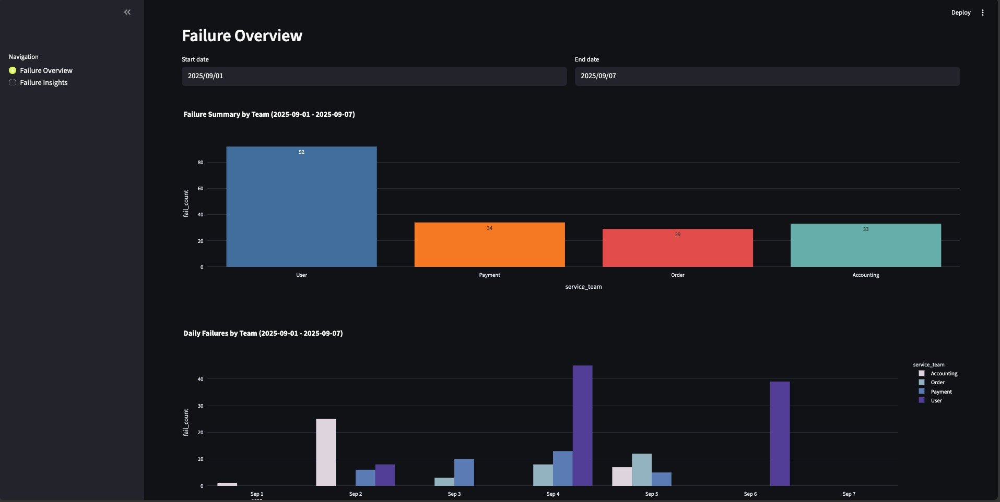
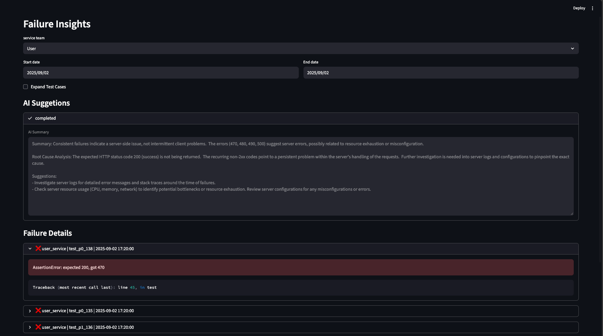
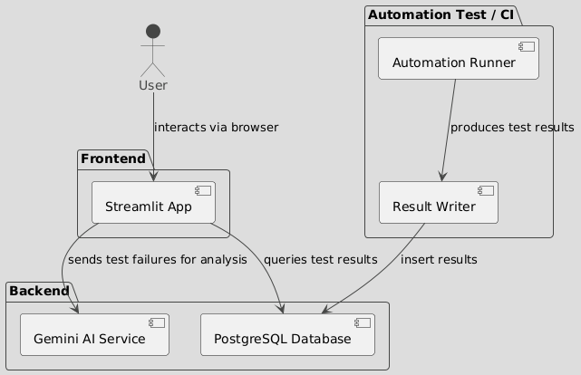
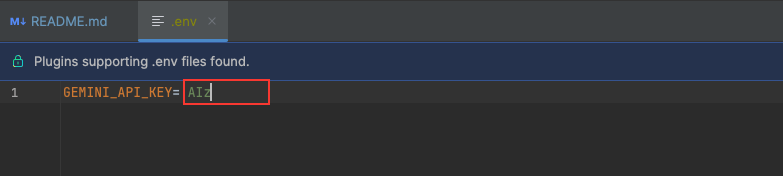

# Automation Test Result Dashboard

A lightweight dashboard to view and analyze test automation results. <br> 
Built with Streamlit + PostgreSQL, and powered by AI (Gemini) to help debug test failures faster.

## 💫 Result

### Overview


### Insights (AI Analysis / Failed Case Details)


## ✨ Feature

*   **Test Result Centralization** – See results from all services in one place
*   **Interactive UI** – A user-friendly web interface to view and filter test execution data
*   **Analytics** – View trends: fail count, test duration
*   **AI Insights** – Use Gemini (or other LLMs) to summarize failed logs

## 🧠 Business Value

This dashboard helps engineering teams to:
*   **Monitor Testing Quality** – Track fail trends and find unstable test cases over time.
*   **Catch CI Failures Quickly** – View automation results from all services in one place.
*   **Speed Up Failure Debugging** – Use LLMs (Gemini, OpenAI) to analyze failed logs and errors.
*   **Focus on Important Failures** – Easily see P0/P1 failures and reduce noise from flaky tests.
*   **Improve Team Visibility** – QA, Dev, and PMs all share the same clear testing overview.


## 🛠️ Tech Stack

*   **Backend / Dashboard**: Python 3.13, Streamlit
*   **Database**: PostgreSQL
*   **Containerization**: Docker, Docker Compose

## 🪧 Diagram


## 🏗️ Project Structure

```commandline
.
├── run.py                              # Entry point for the Streamlit dashboard
├── database/                           # DB helper classes and config
│   ├── postgresql_helper.py            # Postgres connection logic
│   ├── config.py                       # Env-based DB config
│   └── business.py                     # Business logic to fetch and transform data
├── llm/                                # AI (e.g. Gemini) related helpers
│   ├── gemini_helper.py                # Gemini API wrapper
│   └── cache.py                        # Optional local caching
├── utility/
│   └── enum.py                         # Shared enums for status types, etc.
├── deployment/                         # Docker & Compose configs
│   ├── Dockerfile                      # Builds dashboard image
│   ├── docker-compose-dev.yml          # Dev Compose with volumes
│   ├── docker-compose-prod.yml         # Optional for prod
│   └── init.sql                        # Initializes DB schema
├── requirements.txt / poetry.lock / pyproject.toml
└── README.md

```

## 🚀 Getting Started

Use the steps below to set up and run this project locally.

### Setup Gemini API key
`deployment/.env`


### Run via Docker Compose
```commandline
$ make run-dev
```

### Create DB Schema (Only run once)
```sql
CREATE TABLE IF NOT EXISTS automation_test_result (
    id SERIAL PRIMARY KEY,
    service TEXT NOT NULL,
    service_team TEXT NOT NULL, -- The dev team
    request_id TEXT,
    is_rerun BOOLEAN DEFAULT FALSE,
    trigger_status INT NOT NULL, -- 0=start, 1=success, 2=failed (infra down etc.), 99=unknown
    trigger_type INT NOT NULL, -- 0=manual, 1=dailyAutomation, 3=ci/cd
    trigger_user TEXT,

    case_total_count INTEGER DEFAULT 0,
    success_count INTEGER DEFAULT 0,
    skip_count INTEGER DEFAULT 0,
    failure_count INTEGER DEFAULT 0,
    broken_count INTEGER DEFAULT 0,
    all_test_records JSONB, -- Record TC name, status (passed, failed, skipped, broken), duration, tags
    failure_records JSONB, -- Record TC's failure details

    duration FLOAT DEFAULT 0, -- Overall testing duration
    start_time TIMESTAMP,
    end_time TIMESTAMP,

    create_time TIMESTAMP DEFAULT NOW(),
    update_time TIMESTAMP DEFAULT NOW()
);
```

### Insert Sample Data (For Local Testing Only)
To test the dashboard without running a full test pipeline, you can manually insert sample data into the PostgreSQL database.
This is especially useful during development or UI prototyping.

([insert_test_data_sample.sql](readme/insert_test_data_sample.sql))
```commandline
INSERT INTO automation_test_result (service, service_team, request_id, is_rerun, trigger_status, trigger_type, trigger_user, case_total_count, success_count, skip_count, failure_count, broken_count, all_test_records, failure_records, duration, start_time, end_time, create_time, update_time) VALUES ('cod_service',  'Payment',  'req-201000',  FALSE,  2,  2,  'Alex',  101,  99,  0,  1,  1,  '[{"name": "test_p1_0",  "status": "passed",  "duration": 0.55},  {"name": "test_p1_1",  "status": "passed",  "duration": 0.95},  {"name": "test_p1_2",  "status": "passed",  "duration": 0.4},  {"name": "test_p1_3",  "status": "passed",  "duration": 0.46},  {"name": "test_p1_4",  "status": "passed",  "duration": 1.15},  {"name": "test_p1_5",  "status": "passed",  "duration": 0.22},  {"name": "test_p1_6",  "status": "passed",  "duration": 0.84},  {"name": "test_p1_7",  "status": "passed",  "duration": 0.85},  {"name": "test_p1_8",  "status": "passed",  "duration": 0.12},  {"name": "test_p1_9",  "status": "passed",  "duration": 0.1},  {"name": "test_p1_10",  "status": "passed",  "duration": 0.89},  {"name": "test_p1_11",  "status": "passed",  "duration": 0.13},  {"name": "test_p1_12",  "status": "passed",  "duration": 0.38},  {"name": "test_p1_13",  "status": "passed",  "duration": 0.81},  {"name": "test_p1_14",  "status": "passed",  "duration": 1.38},  {"name": "test_p1_15",  "status": "passed",  "duration": 1.17},  {"name": "test_p1_16",  "status": "passed",  "duration": 0.18},  {"name": "test_p1_17",  "status": "passed",  "duration": 0.47},  {"name": "test_p1_18",  "status": "passed",  "duration": 0.66},  {"name": "test_p1_19",  "status": "passed",  "duration": 0.37},  {"name": "test_p1_20",  "status": "passed",  "duration": 0.36},  {"name": "test_p1_21",  "status": "passed",  "duration": 0.13},  {"name": "test_p1_22",  "status": "passed",  "duration": 1.45},  {"name": "test_p1_23",  "status": "passed",  "duration": 0.37},  {"name": "test_p1_24",  "status": "passed",  "duration": 1.26},  {"name": "test_p1_25",  "status": "passed",  "duration": 0.75},  {"name": "test_p1_26",  "status": "passed",  "duration": 0.86},  {"name": "test_p1_27",  "status": "passed",  "duration": 0.93},  {"name": "test_p1_28",  "status": "passed",  "duration": 1.06},  {"name": "test_p1_29",  "status": "passed",  "duration": 1.46},  {"name": "test_p1_30",  "status": "passed",  "duration": 0.85},  {"name": "test_p1_31",  "status": "passed",  "duration": 0.14},  {"name": "test_p1_32",  "status": "passed",  "duration": 0.73},  {"name": "test_p1_33",  "status": "passed",  "duration": 0.27},  {"name": "test_p1_34",  "status": "passed",  "duration": 0.8},  {"name": "test_p1_35",  "status": "passed",  "duration": 0.53},  {"name": "test_p1_36",  "status": "passed",  "duration": 0.68},  {"name": "test_p1_37",  "status": "passed",  "duration": 0.71},  {"name": "test_p1_38",  "status": "passed",  "duration": 1.45},  {"name": "test_p1_39",  "status": "passed",  "duration": 0.98},  {"name": "test_p1_40",  "status": "passed",  "duration": 0.94},  {"name": "test_p1_41",  "status": "passed",  "duration": 0.91},  {"name": "test_p1_42",  "status": "passed",  "duration": 0.5},  {"name": "test_p1_43",  "status": "passed",  "duration": 1.34},  {"name": "test_p1_44",  "status": "passed",  "duration": 1.33},  {"name": "test_p1_45",  "status": "passed",  "duration": 0.57},  {"name": "test_p1_46",  "status": "passed",  "duration": 1.04},  {"name": "test_p1_47",  "status": "passed",  "duration": 1.0},  {"name": "test_p1_48",  "status": "passed",  "duration": 0.4},  {"name": "test_p1_49",  "status": "passed",  "duration": 0.35},  {"name": "test_p1_50",  "status": "passed",  "duration": 0.87},  {"name": "test_p1_51",  "status": "passed",  "duration": 0.89},  {"name": "test_p1_52",  "status": "passed",  "duration": 0.5},  {"name": "test_p1_53",  "status": "passed",  "duration": 0.26},  {"name": "test_p1_54",  "status": "passed",  "duration": 0.64},  {"name": "test_p1_55",  "status": "passed",  "duration": 0.84},  {"name": "test_p1_56",  "status": "passed",  "duration": 0.88},  {"name": "test_p1_57",  "status": "passed",  "duration": 1.13},  {"name": "test_p1_58",  "status": "passed",  "duration": 0.42},  {"name": "test_p1_59",  "status": "passed",  "duration": 0.95},  {"name": "test_p1_60",  "status": "passed",  "duration": 0.13},  {"name": "test_p1_61",  "status": "passed",  "duration": 0.81},  {"name": "test_p1_62",  "status": "passed",  "duration": 0.57},  {"name": "test_p1_63",  "status": "passed",  "duration": 0.44},  {"name": "test_p1_64",  "status": "passed",  "duration": 1.07},  {"name": "test_p1_65",  "status": "passed",  "duration": 0.21},  {"name": "test_p1_66",  "status": "passed",  "duration": 0.1},  {"name": "test_p1_67",  "status": "passed",  "duration": 0.14},  {"name": "test_p1_68",  "status": "passed",  "duration": 0.26},  {"name": "test_p1_69",  "status": "passed",  "duration": 1.06},  {"name": "test_p1_70",  "status": "passed",  "duration": 0.12},  {"name": "test_p1_71",  "status": "passed",  "duration": 0.98},  {"name": "test_p1_72",  "status": "passed",  "duration": 0.77},  {"name": "test_p1_73",  "status": "passed",  "duration": 1.23},  {"name": "test_p1_74",  "status": "passed",  "duration": 1.46},  {"name": "test_p1_75",  "status": "passed",  "duration": 0.72},  {"name": "test_p1_76",  "status": "passed",  "duration": 0.82},  {"name": "test_p1_77",  "status": "passed",  "duration": 0.36},  {"name": "test_p1_78",  "status": "passed",  "duration": 0.68},  {"name": "test_p1_79",  "status": "passed",  "duration": 0.42},  {"name": "test_p1_80",  "status": "passed",  "duration": 1.14},  {"name": "test_p1_81",  "status": "passed",  "duration": 0.71},  {"name": "test_p1_82",  "status": "passed",  "duration": 1.48},  {"name": "test_p1_83",  "status": "passed",  "duration": 1.08},  {"name": "test_p1_84",  "status": "passed",  "duration": 1.18},  {"name": "test_p1_85",  "status": "passed",  "duration": 1.1},  {"name": "test_p1_86",  "status": "passed",  "duration": 0.95},  {"name": "test_p1_87",  "status": "passed",  "duration": 0.4},  {"name": "test_p1_88",  "status": "passed",  "duration": 1.43},  {"name": "test_p1_89",  "status": "passed",  "duration": 0.39},  {"name": "test_p1_90",  "status": "passed",  "duration": 0.97},  {"name": "test_p1_91",  "status": "passed",  "duration": 1.0},  {"name": "test_p1_92",  "status": "passed",  "duration": 1.32},  {"name": "test_p1_93",  "status": "passed",  "duration": 0.19},  {"name": "test_p1_94",  "status": "passed",  "duration": 0.87},  {"name": "test_p1_95",  "status": "passed",  "duration": 1.31},  {"name": "test_p1_96",  "status": "passed",  "duration": 0.17},  {"name": "test_p1_97",  "status": "passed",  "duration": 0.28},  {"name": "test_p1_98",  "status": "passed",  "duration": 0.29},  {"name": "test_p0_99",  "status": "failed",  "duration": 1.22},  {"name": "test_p1_100",  "status": "broken",  "duration": 0.67}]'::jsonb,  '[{"name": "test_p0_100",  "error": "AssertionError: expected 200, '[{"name": "test_p0_100", "error": "AssertionError: expected 200): line 42, in test"}]'::jsonb, 9.8, '2025-09-05 16:52:00', '2025-09-05 17:01:45', '2025-09-05 12:00:00', '2025-09-05 12:00:00');
INSERT INTO automation_test_result (service, service_team, request_id, is_rerun, trigger_status, trigger_type, trigger_user, case_total_count, success_count, skip_count, failure_count, broken_count, all_test_records, failure_records, duration, start_time, end_time, create_time, update_time) VALUES ('cod_service',  'Payment',  'req-201001',  FALSE,  2,  1,  'Leo',  82,  70,  5,  4,  3,  '[{"name": "test_p1_1",  "status": "passed",  "duration": 0.81},  {"name": "test_p1_2",  "status": "passed",  "duration": 1.06},  {"name": "test_p1_3",  "status": "passed",  "duration": 0.68},  {"name": "test_p1_4",  "status": "passed",  "duration": 1.32},  {"name": "test_p1_5",  "status": "passed",  "duration": 0.8},  {"name": "test_p1_6",  "status": "passed",  "duration": 1.08},  {"name": "test_p1_7",  "status": "passed",  "duration": 0.97},  {"name": "test_p1_8",  "status": "passed",  "duration": 0.92},  {"name": "test_p1_9",  "status": "passed",  "duration": 0.84},  {"name": "test_p1_10",  "status": "passed",  "duration": 0.31},  {"name": "test_p1_11",  "status": "passed",  "duration": 1.21},  {"name": "test_p1_12",  "status": "passed",  "duration": 0.81},  {"name": "test_p1_13",  "status": "passed",  "duration": 1.13},  {"name": "test_p1_14",  "status": "passed",  "duration": 0.86},  {"name": "test_p1_15",  "status": "passed",  "duration": 0.34},  {"name": "test_p1_16",  "status": "passed",  "duration": 0.19},  {"name": "test_p1_17",  "status": "passed",  "duration": 1.17},  {"name": "test_p1_18",  "status": "passed",  "duration": 0.39},  {"name": "test_p1_19",  "status": "passed",  "duration": 1.46},  {"name": "test_p1_20",  "status": "passed",  "duration": 1.41},  {"name": "test_p1_21",  "status": "passed",  "duration": 1.33},  {"name": "test_p1_22",  "status": "passed",  "duration": 0.64},  {"name": "test_p1_23",  "status": "passed",  "duration": 1.19},  {"name": "test_p1_24",  "status": "passed",  "duration": 0.53},  {"name": "test_p1_25",  "status": "passed",  "duration": 0.34},  {"name": "test_p1_26",  "status": "passed",  "duration": 1.24},  {"name": "test_p1_27",  "status": "passed",  "duration": 1.12},  {"name": "test_p1_28",  "status": "passed",  "duration": 0.69},  {"name": "test_p1_29",  "status": "passed",  "duration": 0.85},  {"name": "test_p1_30",  "status": "passed",  "duration": 0.74},  {"name": "test_p1_31",  "status": "passed",  "duration": 1.32},  {"name": "test_p1_32",  "status": "passed",  "duration": 0.42},  {"name": "test_p1_33",  "status": "passed",  "duration": 0.49},  {"name": "test_p1_34",  "status": "passed",  "duration": 1.1},  {"name": "test_p1_35",  "status": "passed",  "duration": 1.29},  {"name": "test_p1_36",  "status": "passed",  "duration": 0.49},  {"name": "test_p1_37",  "status": "passed",  "duration": 0.28},  {"name": "test_p1_38",  "status": "passed",  "duration": 0.96},  {"name": "test_p1_39",  "status": "passed",  "duration": 0.24},  {"name": "test_p1_40",  "status": "passed",  "duration": 1.28},  {"name": "test_p1_41",  "status": "passed",  "duration": 1.0},  {"name": "test_p1_42",  "status": "passed",  "duration": 0.48},  {"name": "test_p1_43",  "status": "passed",  "duration": 0.12},  {"name": "test_p1_44",  "status": "passed",  "duration": 0.34},  {"name": "test_p1_45",  "status": "passed",  "duration": 0.22},  {"name": "test_p1_46",  "status": "passed",  "duration": 0.87},  {"name": "test_p1_47",  "status": "passed",  "duration": 0.18},  {"name": "test_p1_48",  "status": "passed",  "duration": 0.79},  {"name": "test_p1_49",  "status": "passed",  "duration": 0.19},  {"name": "test_p1_50",  "status": "passed",  "duration": 0.29},  {"name": "test_p1_51",  "status": "passed",  "duration": 0.31},  {"name": "test_p1_52",  "status": "passed",  "duration": 1.34},  {"name": "test_p1_53",  "status": "passed",  "duration": 0.94},  {"name": "test_p1_54",  "status": "passed",  "duration": 0.5},  {"name": "test_p1_55",  "status": "passed",  "duration": 0.86},  {"name": "test_p1_56",  "status": "passed",  "duration": 1.37},  {"name": "test_p1_57",  "status": "passed",  "duration": 0.31},  {"name": "test_p1_58",  "status": "passed",  "duration": 0.18},  {"name": "test_p1_59",  "status": "passed",  "duration": 1.13},  {"name": "test_p1_60",  "status": "passed",  "duration": 1.08},  {"name": "test_p1_61",  "status": "passed",  "duration": 1.15},  {"name": "test_p1_62",  "status": "passed",  "duration": 0.58},  {"name": "test_p1_63",  "status": "passed",  "duration": 0.27},  {"name": "test_p1_64",  "status": "passed",  "duration": 1.3},  {"name": "test_p1_65",  "status": "passed",  "duration": 0.46},  {"name": "test_p1_66",  "status": "passed",  "duration": 1.17},  {"name": "test_p1_67",  "status": "passed",  "duration": 1.03},  {"name": "test_p1_68",  "status": "passed",  "duration": 0.71},  {"name": "test_p1_69",  "status": "passed",  "duration": 1.13},  {"name": "test_p1_70",  "status": "passed",  "duration": 0.69},  {"name": "test_p0_71",  "status": "skipped",  "duration": 0.0},  {"name": "test_p0_72",  "status": "skipped",  "duration": 0.0},  {"name": "test_p0_73",  "status": "skipped",  "duration": 0.0},  {"name": "test_p0_74",  "status": "skipped",  "duration": 0.0},  {"name": "test_p0_75",  "status": "skipped",  "duration": 0.0},  {"name": "test_p0_76",  "status": "failed",  "duration": 0.28},  {"name": "test_p0_77",  "status": "failed",  "duration": 1.03},  {"name": "test_p0_78",  "status": "failed",  "duration": 1.12},  {"name": "test_p0_79",  "status": "failed",  "duration": 1.6},  {"name": "test_p1_80",  "status": "broken",  "duration": 1.05},  {"name": "test_p1_81",  "status": "broken",  "duration": 1.79},  {"name": "test_p1_82",  "status": "broken",  "duration": 2.33}]'::jsonb,  '[{"name": "test_p0_101",  "error": "AssertionError: expected 200, '[{"name": "test_p0_101", "error": "AssertionError: expected 200): line 42, in test"}, {"name": "test_p1_102", "error": "AssertionError: expected 200, got 490", "traceback": "Traceback (most recent call last): line 43, in test"}, {"name": "test_p1_103", "error": "AssertionError: expected 200, got 480", "traceback": "Traceback (most recent call last): line 44, in test"}, {"name": "test_p0_104", "error": "AssertionError: expected 200, got 470", "traceback": "Traceback (most recent call last): line 45, in test"}]'::jsonb, 3.5, '2025-09-13 05:15:00', '2025-09-13 05:18:32', '2025-09-05 12:00:00', '2025-09-05 12:00:00');
... ...
```

## 🔍 Future Plans / Roadmap

- Login & Team-level access control
- Trend charts grouped by tag / test suite / branch
- Slack / Email alert integration
- Click-to-Rerun Failed Test (via CI/CD webhook)
- Historical comparison (e.g., what changed since last run)
- Multi-environment support (test, uat, staging, prod)
- Full-text search in error messages
- CSV / JSON export of test results
